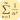

  

<h1 align=center>
  Logseq Display Math
</h1>

  <em>Tweak LaTeX rendering and styling</em>

  
  

## Features

- Make all math render in display style.
- Configurable KaTeX macros in settings.

## How it works

This is a simple plugin which hijacks `katex`'s `render` function to add `\displaystyle` and user-defined macros.

## How to temporarily disable `\displaystyle`

Just add `\textstyle` in the front: `\textstyle \sum_{n=1}^{\infty}\frac{1}{n^s}`
